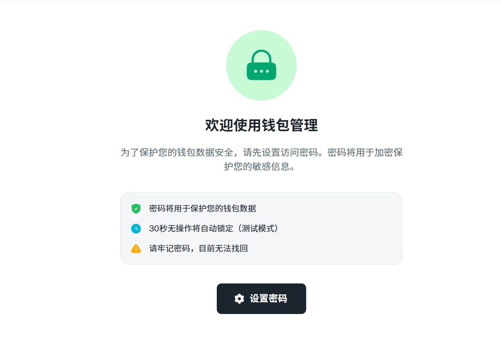

# 💼 创建钱包

[访问功能页面 →](http://104.143.46.112:8082/wallet/create/)

## 🧩 功能简介

此功能支持一键生成去中心化钱包，适用于多链（ETH / BSC / SOL）。

## 🚀 使用步骤

1. 首次使用请设置密码

<figure><figcaption>
密码将用于保护您的钱包数据 30秒无操作将自动锁定（测试模式） 请牢记密码，目前无法找回
</figcaption></figure>

1.
2. 妥善保存助记词与私钥
3. 可导出钱包地址列表

## ⚠️ 注意事项

* 请勿截图保存助记词
* 切勿上传私钥至云端
* 建议使用冷钱包备份
